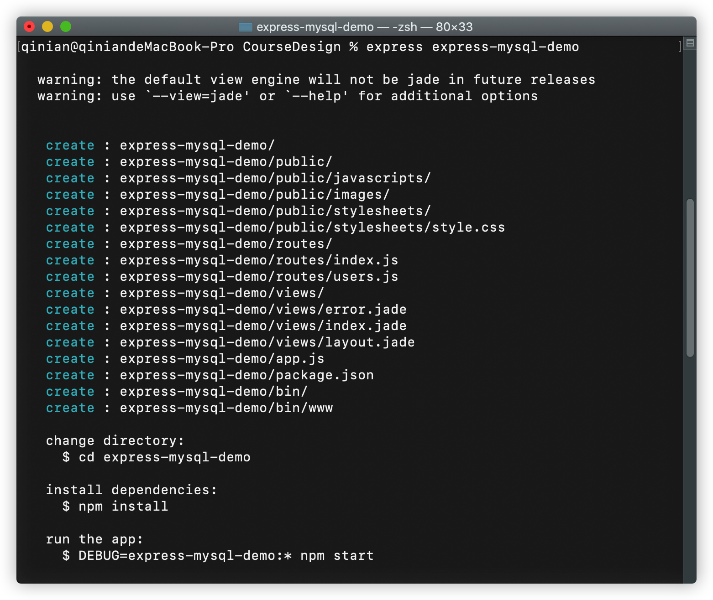
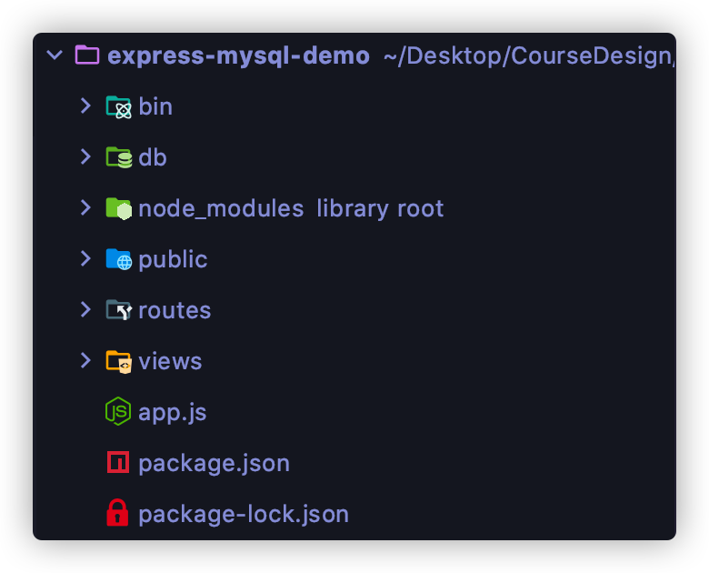
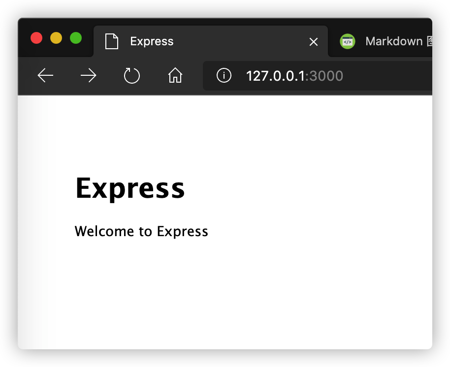

## 一、准备工作
#### 1. 安装Express
```shell script
npm install express -g
npm install express-generator -g
```
注：可能需要sudo
#### 2. 初始化项目
进入某一文件夹
```shell script
cd /xxx/xxx/xxx
```
创建并初始化一个项目，这里项目名以express-mysql-demo为例
```shell script
express express-mysql-demo
```


在终端最后可以看到几个命令
```shell script
change directory:
  $ cd express-mysql-demo // 进入项目目录

install dependencies:
  $ npm install // 安装依赖(依赖配置文件在package.json中)

run the app:
  $ DEBUG=express-mysql-demo:* npm start // 启动服务器
```
按提示执行`cd express-mysql-demo`进入到项目目录并执行`npm install`安装依赖即可（可能需要sudo）。

用编译器打开项目


- /bin : 用来启动服务器
- /public : 存放静态资源
- /routes : 路由用于确定如何响应对特定端点的客户机请求，包含一个URI和一个特定的HTTP请求方法（GET、POST等）。
每个路由可以有一个或多个处理程序函数，这些函数在路由匹配时执行。

- /views : 模板文件目录，文件格式默认为`*.jade`
- /app.js : 程序主文件，是服务器启动的入口
## 二、启动服务器
终端中输入`npm start`启动服务器

> 注：关闭时要用<kbd>Ctrl</kbd>+<kbd>C</kbd>关闭服务器，否则下次再启动时会提示3000端口被占用！
> 
> 端口被占用解决方法：
>
> 终端中输入`lsof -i :3000`找到node进程的PID
>
> 输入`kill -9 PID`即可结束该进程

启动成功终端会输出以下信息：
```shell script
> express-mysql-demo@0.0.1 start /Users/qinian/Desktop/CourseDesign/express-mysql-demo
> node ./bin/www
```
在浏览器中访问<http://127.0.0.1:3000>或<http://localhost:3000>即可看到以下页面：



## 三、安装MySQL模块
打开app.js，这里介绍下主要代码
```javascript
var createError = require('http-errors');
var express = require('express');
var path = require('path');
var cookieParser = require('cookie-parser');
var logger = require('morgan');

var app = express();

// ====== 路由信息（接口地址） 存放在./routes目录下 ====== //
var indexRouter = require('./routes/index');
var usersRouter = require('./routes/users');

app.use('/', indexRouter);
app.use('/users', usersRouter);
// ====== 路由信息（接口地址）介绍  ====== //

// ====== 配置模板引擎 ====== //
// view engine setup
app.set('views', path.join(__dirname, 'views'));
app.set('view engine', 'jade');
// ====== 配置模板引擎 ====== //

app.use(logger('dev'));
app.use(express.json());
app.use(express.urlencoded({ extended: false }));
app.use(cookieParser());
// 配置静态资源目录
app.use(express.static(path.join(__dirname, 'public')));
```
打开`package.json`在`dependencies`中添加
```json
"mysql": "latest"
```
接着在终端中重新输入`npm install`安装依赖，这样就会把mysql依赖安装进来。

接着在项目目录下新建db目录并新建一个`DBConfig.js`，用于存放MySQL配置信息，并添加以下内容：
```js
module.exports = {
    mysql: {
        host: '47.114.6.104', // ip地址
        user: 'root', // 数据库连接用户名
        password: '123456', // 数据库连接密码
        database: 'express-mysql-demo', // 数据库名
        port: 3306, // mysql端口号
        multipleStatements: true // 开启同时执行多条语句，貌似不太安全
    }
}
```
## 四、添加API接口调用SQL语句
在db目录下新建`usersql.js`并添加以下内容：
```js
var UserSQL = {
    insert: 'INSERT INTO user(user_id, username, sex) VALUES(?,?,?)',
    queryAll: 'SELECT * FROM user',
    getUserById: 'SELECT * FROM user WHERE user_id = ?',
    queryBooks: 'SELECT COUNT(*) FROM books; SELECT * FROM books limit ? offset ?'
}

module.exports = UserSQL
```
`usersql.js`的作用是提供增删改查语句。

为了方便分页查询，在项目目录下新建utils文件夹，在该文件夹下新建`utils.js`文件，代码如下：
```js
module.exports.generateBookPages = function (page, totalPage, step) {
    // 将参数转为数字
    page = typeof page === 'number' ? page : parseInt(page);
    totalPage = typeof totalPage === 'number' ? totalPage : parseInt(totalPage);
    step = typeof step === 'number' ? step : parseInt(step);
    if (totalPage <= step) {
        // 总页数小于步长时
        // 1 2 3 4 5 6 7  page = 4, total = 7, step = 10
        return Array.from({length: totalPage}, (item, index) => index + 1);
    }
    if (page <= step / 2) {
        // 前几页时
        // 1 2 3 4 5 6 7 8 9 10 page <= 5, total = 20, step = 10
        return Array.from({length: step}, (item, index) => index + 1);
    }
    if (page >= totalPage - step / 2) {
        // 后几页时
        // 11 12 13 14 15 16 17 18 19 20  page >= 15, total = 20, step = 10
        return Array.from({length: step}, (item, index) => index + totalPage - step + 1);
    }
    // 其他
    // 4 5 6 7 8 9 10 11 12 13  page = 8, total = 20, step = 10
    return Array.from({length: step}, (item, index) => index + page - step / 2 + 1);
}
```
该函数的作用是根据`当前页，总页数，步长`返回当前页相邻的页码。

接着还需在routes目录下新建一个`users.js`向外暴露操作user的API接口，代码如下：
```js
var express = require('express');
var utils = require('../utils/utils')
var router = express.Router();

// 导入MySQL模块
var mysql = require('mysql');
var dbConfig = require('../db/DBConfig');
var userSQL = require('../db/usersql');

// 使用DBConfig.js的配置信息创建一个连接池
var pool = mysql.createPool(dbConfig.mysql);

// 响应一个json数据
var responseJSON = function (res, ret) {
  if (!ret) { // 如果ret为undefined
    res.json({
      code: 200,
      msg: '操作失败'
    });
  } else {
    res.json({
      code: 100,
      msg: '操作成功',
      data: ret
    });
  }
}

// 添加用户
router.get('/addUser', (req, res, next) => {
  // 从连接池获取连接
  pool.getConnection(function (err, connection) {
    // 获取前台页面传入的参数
    var param = req.query || req.params;
    // 建立连接，增加一个用户信息
    connection.query(userSQL.insert, [param.id, param.name, param.sex], function (err, result) {
      // 如果发生错误，result即为undefined
      // 受影响的行数通过result.affectedRows获取
      responseJSON(res, result);
      // 释放连接
      connection.release();
    });
  });
});

/* 获取用户列表 */
router.get('/', function(req, res, next) {
  pool.getConnection(function (err,connection) {
    // 建立连接
    connection.query(userSQL.queryAll, [], function (err, result) {
      // 如果发生错误，result即为undefined
      responseJSON(res, result);
      // 释放连接
      connection.release();
    });
  });
});

// 根据id查找用户
router.get('/findUser', function(req, res, next) {
  pool.getConnection(function (err,connection) {
    // 获取前台页面传入的参数
    var param = req.query || req.params;
    // 建立连接
    connection.query(userSQL.getUserById, [param.id], function (err, result) {
      // 如果发生错误，result即为undefined
      responseJSON(res, result);
      // 释放连接
      connection.release();
    });
  });
});

/* 获取用户列表（分页查询） */
router.get('/books', function(req, res, next) {
  pool.getConnection(function (err,connection) {
    if (err)
      throw err;
    // 获取前台页面传入的参数
    var param = req.query || req.params;
    var page = param.page || 1; // 当前页数，默认第1页
    var num = param.num || 20; // 每页的数据个数，默认20条
    // 建立连接
    connection.query(userSQL.queryBooks, [num, (page - 1) * num], function (err, result) {
      if (result) {
        var totalCount = parseInt(result[0][0]['COUNT(*)']); // 总条数
        var totalPage = Math.ceil(totalCount / num); // 总页数，向上取整
        var currentPage = page;
        var isFirstPage = currentPage == 1;
        var isLastPage = currentPage == totalPage;
        var adjacentPage = utils.generateBookPages(currentPage, totalPage, 10); // 相邻页码，只显示相邻10页
        var bookList = result[1]; // 数据
        res.json({
          code: 100,
          msg: '处理成功',
          totalCount: totalCount,
          totalPage: totalPage,
          currentPage: currentPage,
          isFirstPage: isFirstPage,
          isLastPage: isLastPage,
          adjacentPage: adjacentPage,
          bookList: bookList
        })
      } else {
        responseJSON(res, result);
      }
      // 释放连接
      connection.release();
      if (err)
        throw err;
    });
  });
});

module.exports = router;
```
下面是测试案例：
- 获取用户列表

    URL:<http://127.0.0.1:3000/users>
    
    返回数据：
    ```json
    {
      "code": 100,
      "msg": "操作成功",
      "data": [
        {
          "user_id": 10001,
          "username": "小王",
          "sex": "男"
        },
        {
          "user_id": 10002,
          "username": "肖红",
          "sex": "女"
        }
      ]
    }
    ```
- 插入用户数据

    URL:<http://127.0.0.1:3000/users/addUser?id=10006&name=静静&sex=女>
    
    返回数据：
    ```json
    {
      "code": 100,
      "msg": "操作成功",
      "data": {
        "fieldCount": 0,
        "affectedRows": 1,
        "insertId": 0,
        "serverStatus": 2,
        "warningCount": 0,
        "message": "",
        "protocol41": true,
        "changedRows": 0
      }
    }
    ```
- 根据id查找用户

    URL:<http://127.0.0.1:3000/users/findUser?id=10006>
    
    返回数据：
    ```json
    {
      "code": 100,
      "msg": "操作成功",
      "data": [
        {
          "user_id": 10006,
          "username": "静静",
          "sex": "女"
        }
      ]
    }
    ```
  
 - 查询第7页数据
  
    URL:<http://127.0.0.1:3000/users/books?page=7>
      
    返回数据：
    ```json
    {
      "code": 100,
      "msg": "处理成功",
      "totalCount": 300,
      "totalPage": 15,
      "currentPage": "7",
      "isFirstPage": false,
      "isLastPage": false,
      "adjacentPage": [3, 4, 5, 6, 7, 8, 9, 10, 11, 12],
      "bookList": [
        {
          "book_id": 10120,
          "book_name": "鞋化野受",
          "book_type": "小说",
          "book_aut": "秦勾",
          "book_num": 10
        },
        {
          "book_id": 10121,
          "book_name": "里斯",
          "book_type": "非小说类",
          "book_aut": "鲁石盼屠",
          "book_num": 10
        },
        ...
      ]
    }
    ```